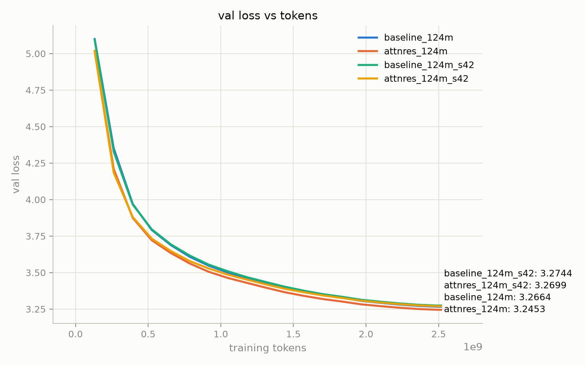
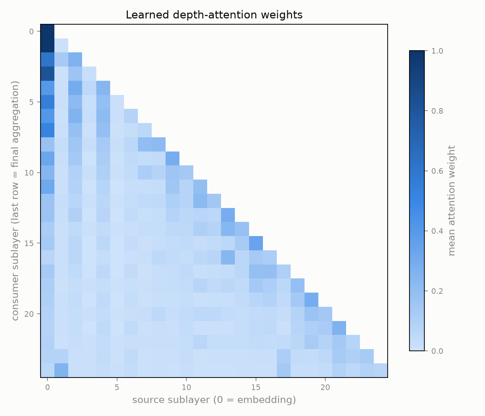

# Attention Residuals — a controlled small-scale reproduction

From-scratch reproduction of **Attention Residuals** (Moonshot AI / Kimi Team,
[arXiv:2603.15031](https://arxiv.org/abs/2603.15031)) at GPT-2-small scale.
The paper observes that standard PreNorm residual connections are depth-wise
*linear* attention with fixed unit weights — every sublayer receives the same
uniformly-weighted sum of the embedding and all preceding sublayer outputs —
and replaces that fixed accumulation with **learned softmax attention over
depth**:

```
h_l = Σ_i α_{i→l} · v_i        α_{i→l} = softmax_i( q_l · RMSNorm(v_i) )
```

where `v_0` is the token embedding, `v_i` are raw sublayer outputs (keys =
values), and `q_l` is a single learned, input-independent, per-consumer
pseudo-query. No official training code exists; this implementation is built
from the paper's pseudocode.

Two properties make a rigorous small-scale study possible:

1. **Exact function preservation at init.** With `q_l = 0`, depth attention is
   a uniform average, which differs from the standard residual sum only by a
   positive per-token scalar — invisible to every (scale-invariant) RMSNorm
   reader of the stream. `tests/test_equivalence.py` verifies bit-level logits
   equivalence in float64. Training starts from the baseline function and
   *learns* to deviate.
2. **No pipeline parallelism needed at this scale**, so we run **Full
   AttnRes** (the strongest variant) rather than the Block variant the paper
   introduces to cut cross-stage communication at 48B scale.

## Setup

```bash
python -m venv .venv && source .venv/bin/activate
pip install -r requirements.txt
pytest tests/                      # must pass before training
python data/prepare_fineweb_edu.py # ~2.6B tokens of FineWeb-Edu, ~5.3 GB disk
```

## Run matrix (4× L40S, ~2.5–3 h per run)

Model: 124M params (12 layers, d=768, RMSNorm + SwiGLU + RoPE, GPT-2 BPE,
tied embeddings), 2048 context, ~2.5B FineWeb-Edu tokens (~Chinchilla-20×),
global batch 524,288 tokens, AdamW + cosine LR.

```bash
./scripts/launch_baseline.sh                 # control arm
./scripts/launch_attnres.sh                  # Full AttnRes
# seed-noise floor: repeat both with train.seed=42 train.run_name=..._s42
./scripts/launch_baseline.sh train.seed=42 train.run_name=baseline_124m_s42
./scripts/launch_attnres.sh  train.seed=42 train.run_name=attnres_124m_s42
# optional ablations
torchrun --standalone --nproc_per_node=4 train.py --config configs/attnres_124m_sigmoid.yaml
torchrun --standalone --nproc_per_node=4 train.py --config configs/attnres_124m_no_keynorm.yaml
```

## Results (124M, 2.5B FineWeb-Edu tokens, 4× A100-SXM4)

| run | seed | final val loss | paired gap (baseline − AttnRes) |
|---|---|---|---|
| baseline | 1337 | 3.2664 | — |
| **Full AttnRes** | 1337 | **3.2453** | **+0.0211** |
| baseline | 42 | 3.2744 | — |
| **Full AttnRes** | 42 | **3.2699** | **+0.0045** |

Under seed- and data-order-matched controls, **both seeds favor AttnRes**
(mean gap +0.013 nats), consistent in direction with the paper's reported
0.01–0.03-nat gains at small scale. Honest caveats: the baseline-to-baseline
seed spread is 0.0080, so the seed-42 gap alone sits inside the noise floor —
with n=2 seeds the magnitude is preliminary (a third seed pair is the cheapest
way to firm this up). Runs used identical shared-weight init and token order;
hyperparameters were tuned on the baseline only.



The learned depth-attention weights reproduce the paper's qualitative
signatures — persistent attention to the token embedding (dark first column),
diagonal dominance, and learned long-range skips — and the residual-source
magnitudes stay bounded across depth under AttnRes while the baseline's grow
monotonically toward the final layers:



**Measured cost of the naive implementation:** baseline sustains 411k tok/s
(32% MFU) on 4×A100; Full AttnRes sustains 62k tok/s (6.6× step time), flat
from step 10 — the O(L²) residual-stream reads, fp32 stream promotion, and
checkpoint recompute dominate at this small scale. This is exactly the cost
the paper's Block AttnRes + two-phase infrastructure exists to avoid at 48B;
a fused kernel for the depth-attention op is the top engineering follow-up.
Raw per-step logs for every run are under `results/<run>/log.jsonl`.

## Sparse+Sink: exploiting the learned wiring (ours)

Analysis of the trained AttnRes models (`analysis/per_token_alpha.py`,
`analysis/wiring_stability.py`) shows the learned depth attention is a
**static sparse skeleton plus a near-uniform tail**: a top-8 source set holds
~80% of deep consumers' attention mass, per-token concentration matches the
token-averaged one (no token-adaptivity), and the wiring is stable across
seeds (0.83 overlap), training time (crystallized by 50% of training), and
data domains (code 0.90, zh 0.86).

`residual_mode: sparse_sink` freezes that skeleton: one softmax over {a
**sink** candidate holding the mean of all non-wired sources (maintained
O(1) from a running sum, with a fixed log(l−K) logit bias so zero init still
exactly reproduces standard residuals) and k statically wired sources
(`analysis/extract_wiring.py`)}. Static *wiring*, input-dependent *weights*.

| arm | final val loss | vs baseline | of Full's gain | attention mass wired |
|---|---|---|---|---|
| Full AttnRes | 3.2453 | +0.0211 | 100% | 100% (reads up to 25 sources) |
| **Sparse+Sink k=8** | 3.2485 | +0.0179 | **85%** | ~80% (reads 9) |
| Sparse+Sink k=4 | 3.2547 | +0.0118 | 56% | ~57% (reads 5-6) |

Gain recovery tracks the attention mass the wiring captures — the mechanism
check for the skeleton+tail decomposition. (k=8 is single-seed so far;
replication with cross-seed-transferred wiring is queued.)

**Fused Triton kernel** (`attnres/triton_sparse_sink.py`, opt-in via
`model.depth_attn_impl=triton`): sink construction, key RMS-norm, biased
softmax, and mixing in one launch per consumer, saving only α — no
activation-checkpoint recompute. Measured on A100: **7.0×** faster than the
eager op; end-to-end Sparse+Sink k=8 drops from 4.29× baseline step time
(eager) to **1.35×** (vs 6.6× for eager Full AttnRes). Parity: fp32
elementwise ≤2e-4; bf16 relative-L2 <2%.

Honest framing: at 124M *every* depth-attention variant costs more
wall-clock than its gain is worth (~10% compute-equivalent); the overhead
amortizes with width (O(k·d) traffic vs O(d²) matmuls) while the gain
persists per the paper's scaling law — measuring that crossover across
scales is the next phase (see [PLAN.md](PLAN.md)).

## Running on a SLURM cluster (Stanford HAIC)

rsync the repo to `/hai/scratch/$USER/LLM_training`, then from the repo root:

```bash
PREP=$(sbatch --parsable scripts/slurm_prepare.sbatch)   # venv + tests + data (CPU)
sbatch --dependency=afterok:$PREP scripts/slurm_train.sbatch configs/baseline_124m.yaml
sbatch --dependency=afterok:$PREP scripts/slurm_train.sbatch configs/attnres_124m.yaml
# seed pair (queues behind the first two -- the per-user quota is 8 GPUs):
sbatch --dependency=afterok:$PREP scripts/slurm_train.sbatch configs/baseline_124m.yaml \
  train.seed=42 train.run_name=baseline_124m_s42
sbatch --dependency=afterok:$PREP scripts/slurm_train.sbatch configs/attnres_124m.yaml \
  train.seed=42 train.run_name=attnres_124m_s42
```

The train script pins `--gres=gpu:h100:4` so every compared run uses identical
hardware; each 124M run is ~30-40 min on 4x H100. MFU peak FLOPS are
auto-detected from the device name (override with the `PEAK_FLOPS_PER_GPU`
env var). Edit `#SBATCH --account=` in both scripts if your team differs.

## Protocol (what makes the comparison mean something)

- **Matched everything.** Baseline and AttnRes runs share the seed (identical
  init of all shared weights — depth-attention params are RNG-free), the data
  order (a pure function of step/rank/world size), and every hyperparameter,
  tuned on the *baseline* (the paper's own conservative protocol).
- **Effect sizes are small.** The paper's gains at this scale are 0.01–0.03
  nats of validation loss. Run both arms under a second seed before claiming a
  gap; the cross-seed spread is your noise floor.
- **Claims live at the loss level.** Downstream-benchmark gains (GPQA +7.5
  etc.) are 48B-scale results; at 124M the reproducible claims are validation
  loss, the ablation ordering (softmax > sigmoid, key-RMSNorm matters), and
  the training-dynamics signatures below.

## Analysis

```bash
python analysis/compare_runs.py out/baseline_124m out/attnres_124m --out compare.png
python analysis/plot_dynamics.py --ckpt out/attnres_124m/latest.pt
```

`plot_dynamics.py` reproduces the paper's diagnostic figures at small scale:
the learned depth-attention heatmap (diagonal dominance + persistent embedding
attention + long-range skips), per-source output magnitudes (bounded for
AttnRes vs. monotone growth for standard residuals), and per-block gradient
norms (more uniform under AttnRes).

## Implementation notes

- Attention and MLP each count as a **separate** AttnRes consumer with their
  own pseudo-query and key-norm (2 per block), plus one final aggregation
  before the output norm — collapsing to per-block granularity silently
  underperforms the paper's setup.
- Depth attention is wrapped in activation checkpointing: Full AttnRes would
  otherwise retain an O(L²) set of stacked-prefix activation copies. The whole
  depth-attention op runs with autocast disabled at residual-stream precision
  (fp32 under bf16 training — matching the standard arm, whose residual
  stream also accumulates in fp32), with the depth softmax in fp32; autocast
  would otherwise silently downcast the einsums back to bf16.
- Full AttnRes reads all preceding sources at every sublayer (O(L²)
  residual-stream traffic). Measured at 124M on 4×A100: 6.6× step time vs
  baseline (62k vs 411k tok/s) — at small scale the stream traffic dominates
  model FLOPs. The paper's <4% overhead figure is for Block AttnRes with
  custom infrastructure at 48B, where model compute dwarfs the stream.
- Data shards are headerless uint16 GPT-2-BPE token streams; batches are a
  pure function of (step, rank, world size), so checkpoint resume reproduces
  the exact stream. Keep world size fixed across compared runs.
- 1-D parameters (norm gains, depth queries) are excluded from weight decay.

## Roadmap

The full research plan (Sparse+Sink design, phase gates, venue targets) lives
in [PLAN.md](PLAN.md).

- [x] Fused Triton kernel for the sparse depth-attention op (7.0× op speedup;
      end-to-end 4.29× → 1.35×)
- [ ] Seed-42 replication of Sparse+Sink k=8 (queued)
- [ ] Third seed pair for the Full-AttnRes comparison
- [ ] 350M/760M scale points + overhead-vs-scale crossover figure
- [ ] Function-preserving **retrofit**: insert zero-init AttnRes into a
      pretrained checkpoint (Pythia/SmolLM2) and continue pretraining — the
      open question the paper leaves untouched
- [ ] Muon optimizer arm (the paper trains everything with Muon)

## References

- Attention Residuals, Moonshot AI, arXiv:2603.15031 —
  [repo](https://github.com/MoonshotAI/Attention-Residuals) (report + figures only)
- Hyper-Connections, ByteDance, arXiv:2409.19606 (learned linear mixing baseline)
- DenseFormer, EPFL, arXiv:2402.02622 (static depth-weighted averaging)
- FineWeb-Edu, HuggingFace, arXiv:2406.17557
